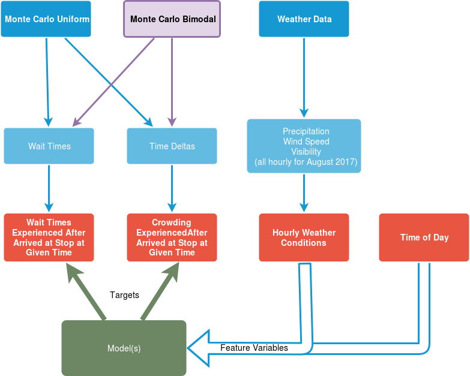

# HamletMTA

*To wait or not to wait, that is the question...*

## Project Aims

Waiting for the bus sucks, you can wait and wait and watch as the ETA on the MTA app pushes further and further away. Can historical data paint a better picture of how long we should wait? Wouldn't it be nice to know with some degree of certainty whether you should hold out for 5, 10, or 15 minutes longer?

## Questions we plan to address

1. Based on a ~10 stops/lines how closely do the actual stop times reflect the posted bus schedules and what is the distribution around the scheduled time that busses actually arrive?

2. What environmental factors impact a buses schedule? What impact does time of day or weather have?

3. Predicting with a defined degree certainty if a bus is coming within a given time frame

## Our Data

[MTA Schedules](http://web.mta.info/nyct/service/bus/bklnsch.htm#top) (need to figure out best way to scrape or source better structured data)

[MTA Bus Statistics](https://www.kaggle.com/stoney71/new-york-city-transport-statistics)

[Weather.Gov](https://www.weather.gov/okx/CentralParkHistorical) Data from a weather monitor in central park; Each day, a 1:30 am report holds 24 hours of weather data starting at 12:00 am EST the previous day and the reports look like [this](https://forecast.weather.gov/product.php?site=NWS&issuedby=NYC&product=CLI&format=CI&version=1&glossary=1&highlight=off).

## How we Use our data

Ultimately, we would like to describe a methodology where late busses are recognized and the reasons for the lateness can be accounted for by the MTA. On the consumer side, the end goal is to take historical data, the rider’s location, and current environmental factors all into account to recommend whether riders ought to wait for the bus or not. 

This diagram offers a brief overview of our analysis; the diagram is explained in more detail below.

### Monte Carlo Simulation

The Monte Carlo simulation will first be carried out with the assumption of uniform probability that a passenger will approach a stop at a given time of day. Later on, we can suppose different ridership behaviors such as a bimodal probability distribution (peak in the early morning and evening for commuters) . 

#### Passenger Wait Times (Sam)
For each simulated passenger that falls on the timeline, we calculate the difference between their arrival time and the arrival of the next bus on that timeline.

(Should produce a biased ecdf.)

#### Bus Time Deltas/headways (David)

Owing to the inspection paradox, we assume that the longer a bus takes to reach it's stop, the more passengers the bus will have to pick up once it reaches the stop. For this step, we do not take into account substitute buses or passengers discarding their plans and leaving out of impatience.

For each simulated passenger, we calculate the probability that each passenger will get on a "crowded" bus.  Such buses feature an abnormally long timedelta. This is categorical data.

(Should produce a biased ecdf.)

### Weather Data (Angelika)

Weather data will include columns for precipitation, wind speed, and visibility for the month of August 2017 in NYC. Remember to ensure that the dates of this data set match the dataset of our timedelta data, since we'll have to join on that later on.

### Machine Learning Model (Angelica & Excel)

The feature variables will be include weather data columns and time of day, while the target variables will be the crowding and wait times as experienced by the passengers (to predict what we simulated in the Monte Carlo method step.) Our goal is 

1. to produce predicts the values of the two biased ecdf **charts** (each of which has a time as input and a probability as output, so it won't display the other inputs to the machine learning model, but hopefully considering more variables should help make the predictions more accurate).

2. to produce a general weather-conscious **model** that predicts passenger experience (inspected wait time and inspected crowdedness)

Considerations for this step include, but are not limited to:

- model evaluation (accuracrecall,prediction, lift and all that)
- model type (linear, non linear/ regression/decision tree)

